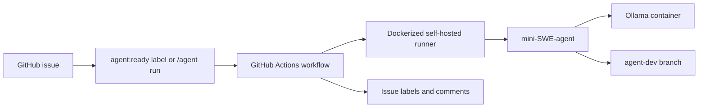

# local-agentic-loop-sample

A template repository for running a local autonomous mini-SWE-agent development loop with Docker, Ollama, and a self-hosted GitHub Actions runner.

The stack keeps model inference local through Ollama, runs mini-SWE-agent inside the Actions runner container, and writes agent changes to a dedicated development branch instead of pushing directly to `main`.

For a full clean-room setup guide, see [step-by-step.md](step-by-step.md).

## How it works

1. A trusted user creates an issue with the **Agent Task** issue template.
2. The user adds the `agent:ready` label, comments `/agent run`, or manually starts the workflow.
3. GitHub Actions schedules the job on the Dockerized self-hosted runner.
4. The workflow checks out `agent-dev`, builds a prompt from the issue, and runs mini-SWE-agent.
5. mini-SWE-agent talks to the `ollama` Docker service at `http://ollama:11434`.
6. If files changed, the workflow commits and pushes them back to `agent-dev`.
7. The workflow updates issue labels and posts the result back to the issue.



## Repository layout

| Path | Purpose |
| --- | --- |
| `.github/workflows/mini-swe-dev-loop.yml` | GitHub Actions workflow that runs the agent and pushes to `agent-dev`. |
| `.github/ISSUE_TEMPLATE/agent-task.yml` | Structured issue template for agent work requests. |
| `docker-compose.yml` | Starts Ollama and the self-hosted runner container. |
| `runner/Dockerfile` | Builds the runner image with Git, GitHub CLI, Node.js, Python, and mini-SWE-agent. |
| `runner/entrypoint.sh` | Registers and starts the self-hosted GitHub Actions runner. |
| `config/mini-local-ollama.yaml` | mini-SWE-agent configuration for the local Ollama model endpoint. |

## Branch model

| Branch | Purpose |
| --- | --- |
| `main` | Template and automation source. Keep this branch protected. |
| `agent-dev` | Agent-produced commits. Leave this branch unprotected or lightly protected so the workflow can push to it. |

The workflow intentionally resets to `origin/agent-dev` and pushes only to `agent-dev`.

## Prerequisites

- Docker with Docker Compose.
- A GitHub repository created from this template.
- Admin access to the repository so you can create self-hosted runner registration tokens.
- A machine that can keep the runner and Ollama containers running.
- Enough local disk for Ollama model storage.

## Quick start

### 1. Create the development branch

Create the branch that will receive agent commits:

```bash
git checkout -b agent-dev
git push -u origin agent-dev
git checkout main
```

### 2. Create the required labels

Create these issue labels in the repository:

- `agent:ready`
- `agent:running`
- `agent:done`
- `agent:failed`
- `agent:blocked`

The issue template starts new agent issues with `agent:candidate`; add that label too if GitHub does not create it automatically.

### 3. Configure workflow permissions

In repository settings, set **Actions > General > Workflow permissions** to **Read and write permissions** so the workflow can commit to `agent-dev` and update issues.

### 4. Prepare Ollama storage

The compose file mounts Ollama data from `/mnt/ollama-usb/ollama` into the container. On Linux, mount external storage and create the directory:

```bash
sudo mkdir -p /mnt/ollama-usb
sudo mount /dev/sdb1 /mnt/ollama-usb
sudo mkdir -p /mnt/ollama-usb/ollama
sudo chmod -R 777 /mnt/ollama-usb/ollama
```

If you want to use a different storage path, update the `ollama` volume in `docker-compose.yml` before starting the stack.

### 5. Create runner environment variables

Create a `.env` file next to `docker-compose.yml`:

```dotenv
GH_RUNNER_REPO_URL=https://github.com/OWNER/REPO
GH_RUNNER_TOKEN=YOUR_RUNNER_REGISTRATION_TOKEN
RUNNER_NAME=docker-mini-swe-runner
```

Get `GH_RUNNER_TOKEN` from **Settings > Actions > Runners > New self-hosted runner**. Runner registration tokens expire, so generate the token immediately before starting the runner.

### 6. Start Docker services

From the repository root:

```bash
docker compose up -d --build
```

Expected services:

- `ollama` exposes Ollama on `http://localhost:11434` from the host and `http://ollama:11434` from the runner container.
- `github-mini-swe-runner` registers with GitHub using labels `self-hosted`, `linux`, `docker`, and `mini-swe-agent`.

### 7. Pull the configured model

The default mini-SWE-agent config uses `qwen2.5-coder:7b`:

```bash
docker exec -it ollama ollama pull qwen2.5-coder:7b
```

To use a different Ollama model, pull it and update `model.model_name` in `config/mini-local-ollama.yaml`.

### 8. Validate the local stack

Check that the runner can reach Ollama and mini-SWE-agent can start:

```bash
docker exec -it github-mini-swe-runner bash
curl http://ollama:11434/api/tags
mini -c /opt/agent-config/mini-local-ollama.yaml -y --exit-immediately -t "Say hello. Do not modify files."
```

## Running an agent task

1. Create a GitHub issue using the **Agent Task** template.
2. Fill in the problem, acceptance criteria, and any useful context.
3. Apply `agent:ready` when a trusted collaborator is ready to run the task.
4. Watch the **Mini SWE Agent Dev Branch Loop** workflow.
5. Review the commit pushed to `agent-dev`.

You can rerun the agent for an existing issue by commenting:

```text
/agent run
```

You can also run the workflow manually with `workflow_dispatch` and provide an issue number.

## mini-SWE-agent and Ollama configuration

`config/mini-local-ollama.yaml` configures mini-SWE-agent to:

- run in `yolo` mode with a `step_limit` of 30;
- disable paid cost tracking by setting `cost_limit: 0` and `cost_tracking: ignore_errors`;
- use `ollama/qwen2.5-coder:7b`;
- connect to Ollama through Docker networking at `http://ollama:11434`;
- use deterministic generation with `temperature: 0`.

Tune this file if you need a different model, step limit, or agent behavior.

## Security and operations notes

- Only trusted collaborators with write, maintain, or admin permissions can trigger the workflow successfully.
- Do not use this pattern for untrusted public contribution paths.
- Do not store production secrets on the runner machine or in the runner container.
- Keep `main` protected and review changes from `agent-dev` before merging.
- The workflow uses one concurrency group to avoid multiple agent runs trampling the same branch.
- The runner unregisters itself on container shutdown, but stale self-hosted runner entries may still need to be removed from GitHub settings after crashes.
